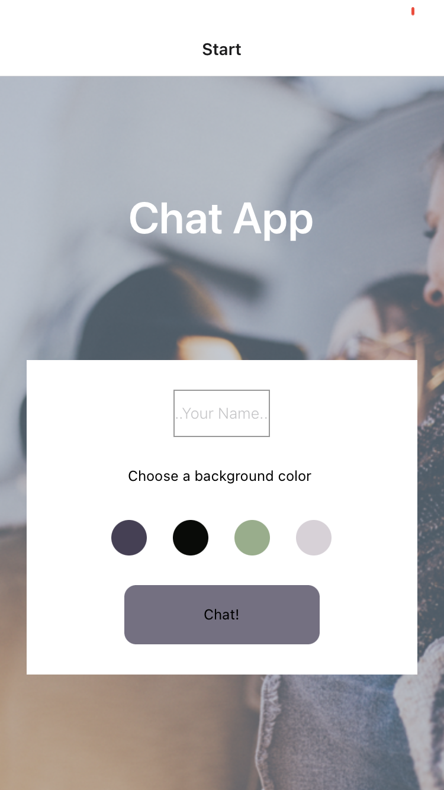

<h2>Chat App</h2>
<h4>Hello World</h4>
 

"Hello World" was created for Android and iOS using React Native. The app allows users to chat with each other, share their location and share photos either from their personal library or taken in real-time.

 
<h4>Created With:<h4>
<ul>
<li>JavaScript</li>
<li>React Native</li>
<li>Expo</li>
<li>Firebase</li>
</ul>
 

<h4>
To run Hello World
</h4>

Clone repository https://github.com/Waledilson/hello-world.git or "git clone https://github.com/Waledilson/hello-world.git" in the command line  
Install Expo (npm install expo) 
Install dependecies (npm install) 
Create an Expo account and login in the command line with "expo login" 
Run the app by typing "expo start" in the command line and use a device simulator or your own device to use it. 

<h4>Database Configuration</h4>

Sign into https://firebase.google.com 
Create new project in Firebase console 
From the dashboard, click "Develop" then "Cloud Firestore" then "Create Databse". When prompted, select "Test Mode" 
Create a new collection called "messages" 
Click "Firestore for Web" or "</>" in "Project Settings" 
Pick a name for the app and click "Register". Copy the credentials and paste them in the cloned repository in your IDE. 

 

 <h4>"dependencies": {</h4>
    "@react-native-async-storage/async-storage": "~1.17.3", 
    "@react-native-community/masked-view": "^0.1.11", 
    "@react-native-community/netinfo": "9.3.0", 
    "@react-navigation/native": "^6.1.3", 
    "@react-navigation/stack": "^6.3.12", 
    "cookies": "^0.8.0", 
    "expo": "^46.0.16", 
    "expo-av": "~12.0.4", 
    "expo-camera": "~12.5.0", 
    "expo-image-picker": "~13.3.1", 
    "expo-location": "~14.3.0", 
    "expo-permissions": "~13.2.0", 
    "expo-status-bar": "~1.4.2", 
    "firebase": "8.10.1", 
    "react": "18.0.0", 
    "react-dom": "18.0.0", 
    "react-native": "0.69.6", 
    "react-native-gesture-handler": "~2.5.0", 
    "react-native-gifted-chat": "^1.1.1", 
    "react-native-maps": "0.31.1", 
    "react-native-web": "0.18.9", 
    "react-navigation": "^4.4.4" 
  },
  <h4>"devDependencies": {</h4>
    "@babel/core": "^7.9.0" 
  }
  

  
